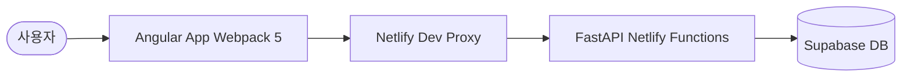

# 🚀 LetsStudySaaS

**LetsStudySaaS**는 **Angular** 프론트엔드와 **FastAPI** 백엔드를 결합한 현대적인 언어 학습 SaaS 플랫폼 템플릿입니다. **Supabase**의 실시간 데이터베이스 기능과 **Netlify**의 서버리스 아키텍처를 활용하여 빠르고 확장 가능한 풀스택 애플리케이션 개발을 체험할 수 있도록 설계되었습니다.

[](https://angular.io/)
[](https://fastapi.tiangolo.com/)
[](https://yarnpkg.com/)
[](https://supabase.com/)
[](https://www.netlify.com/)

---

## ✨ 핵심 기능

- **다국어 지원 (I18n)**: 한국어와 영어를 지원하는 내장된 언어 서비스.
- **워크북 관리**: Angular 컴포넌트 기반의 직관적인 대시보드 인터페이스.
- **실시간 API 상태 진단**: Backend(FastAPI)와 Frontend 간의 연결 상태 실시간 모니터링.
- **최신 아키텍처**: Webpack 5 커스텀 설정과 Yarn Berry(PnP)를 통한 고성능 빌드 환경.
- **서버리스 백엔드**: Mangum을 활용하여 FastAPI를 Netlify Functions 환경에서 실행.

---

## 🏗️ 시스템 아키텍처



---

## 📂 프로젝트 구조

```text
LetsStudySaaS/
├── Frontend/           # Angular + Webpack 애플리케이션
│   ├── src/            # 핵심 비즈니스 로직 및 컴포넌트 (Home, Workbook, Practice)
│   └── webpack.config.js # 최적화된 Webpack 빌드 설정
├── Backend/            # Python FastAPI 애플리케이션
│   ├── main.py         # API 엔트리포인트 및 핸들러 설정
│   └── database.py     # Supabase SDK 연동 모듈
├── netlify/
│   └── functions/      # Netlify 환경을 위한 서버리스 래퍼 (api.py)
├── netlify.toml        # 프록시 및 배포 자동화 설정
├── requirements.txt    # Netlify Functions 의존성 (Root)
└── DEPLOYMENT.md       # 프로덕션 배포 상세 가이드
```

---

## 🛠️ 로컬 개발 환경 설정

### 1. 사전 요구사항
- **Node.js**: v18.0.0 이상
- **Python**: v3.9.0 이상
- **Yarn**: Berry v4 (Node 18+에서 `corepack enable` 권장)
- **Netlify CLI**: `npm install -g netlify-cli`

### 2. 초기 설정
```powershell
# 1. 얀 설정 (Berry 활성화)
corepack enable
yarn set version berry

# 2. 의존성 설치 (Frontend)
cd Frontend
yarn install

# 3. 가상환경 설정 (Backend)
cd ../Backend
python -m venv venv
.\venv\Scripts\Activate.ps1 # Windows
pip install -r requirements.txt
```

### 3. 전체 실행 (Netlify Dev)
루트 디렉토리에서 아래 명령어를 실행하면 Netlify가 프론트엔드와 백엔드를 동시에 실행하고 프록시를 구성합니다.
```powershell
netlify dev
```
- **프론트엔드 접속**: [http://localhost:8888](http://localhost:8888)
- **API 헬스체크**: [http://localhost:8888/api/health](http://localhost:8888/api/health)

---

## 📄 라이선스

이 프로젝트는 **GNU Affero General Public License v3.0**에 따라 라이선스가 부여됩니다. 자세한 내용은 [LICENSE](file:///c:/Users/turbo/Documents/yh/LetsStudySaaS/LICENSE) 파일을 확인하세요.
